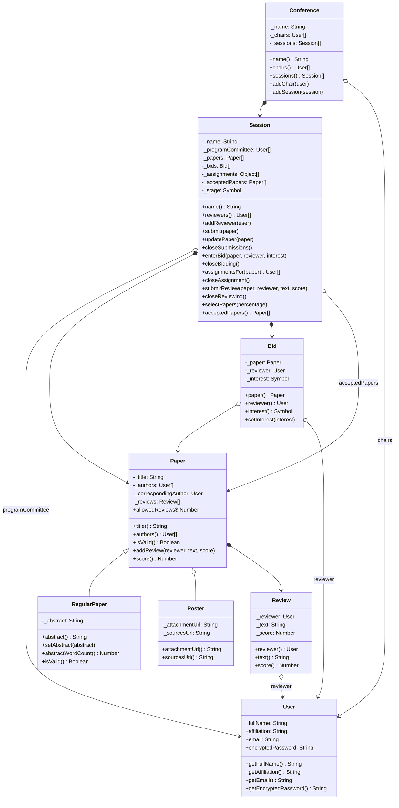

# Documento de Decisiones — ComfyChair TP1

## Contexto

El sistema ComfyChair modela conferencias científicas con sesiones (*tracks*) que gestionan el ciclo completo de vida de un artículo: recepción, bidding, asignación de revisores, carga de revisiones y selección de trabajos aceptados.

---

## Decisiones de diseño

### Decisión 1 — Mantener la lógica principal en `Session`

Toda la lógica de asignación, carga de reviews y selección vive en `Session`, que ya tiene el contexto completo del flujo (artículos, bids, comité de programa y etapa actual). Extraer clases auxiliares hubiera agregado complejidad innecesaria para el alcance del TP. La asignación se encapsula en `_autoAssignReviewers()`, invocado automáticamente por `closeBidding()`.

---

### Decisión 2 — Asignación de revisores: estructura y prioridad

Cubre **4.1 — Asignación de revisores**. Las asignaciones se almacenan en `_assignments[]` como objetos literales `{ paper, reviewer }` — no se creó una clase separada porque una asignación no tiene comportamiento propio más allá de vincular esos dos objetos. El método `assignmentsFor(paper)` permite consultarlas. El algoritmo en `_autoAssignReviewers()` recorre los grupos `Interested → Maybe → sin bid → NotInterested`; la ausencia de bid se distingue de `NotInterested` comparando contra `null`, otorgándole prioridad intermedia (sección 2.5 del enunciado). Tests: `should receive bids`, `should allow overriding bids`.

---

### Decisión 3 — Delegar el almacenamiento de revisiones a `Paper`

Cubre **4.2 — Carga de revisiones**. `submitReview()` en `Session` valida las reglas de negocio (etapa correcta, revisor asignado, puntaje en rango −3 a +3) y delega el almacenamiento en `paper.addReview()`. Las reviews pertenecen al estado del artículo y son necesarias para calcular su score promedio. Tests: `should receive up to 3 reviews`, `score should be the score average of its reviews`.

---

### Decisión 3 — Excluir autores del proceso de asignación (conflicto de interés)

Cubre el punto opcional de **4.1**. Todo revisor que figure en `paper.authors()` es omitido silenciosamente en `_autoAssignReviewers()`. La simulación (`sessionBucketS3`) demuestra este caso: dos de tres revisores son autores del paper, quedando solo uno asignado.

---

### Decisión 4 — Selección de papers por corte fijo con `Math.floor`

Cubre **4.3 — Selección de artículos**. `selectPapers(percentage)` ordena los papers por score descendente y acepta los primeros `Math.floor(totalPapers * percentage / 100)`. Se usa `Math.floor` porque el porcentaje es un máximo (sección 2.7): nunca se puede superar esa proporción. El desempate por igual score preserva el orden de envío original (sort estable de JavaScript).

---

### Decisión 5 — `Assignment` como etapa explícita con transición `closeAssignment()`

El enunciado no especifica si la asignación debe ser una etapa observable. Se decidió modelarla como etapa explícita (`Stages.Assignment`) entre `Bidding` y `Reviewing`, permitiendo consultar y validar asignaciones antes de habilitar la carga de reviews.

---

### Decisión 6 — `updatePaper()` para modificar papers en etapa Receiving

El enunciado establece que los envíos pueden modificarse hasta el cierre de la etapa (sección 2.3). `updatePaper(paper)` valida que la sesión esté en `Receiving`, que el paper pertenezca a la sesión y que siga siendo válido. El llamador aplica el cambio antes de invocar el método.

---

## Diagramas

### Diagrama de Clases



---

## Observaciones

Durante la implementación se identificaron aspectos no completamente especificados en el enunciado:

- No se especifica una estrategia obligatoria para distribuir la carga de revisiones cuando hay múltiples candidatos válidos en la misma prioridad. Se implementó la cuota máxima con `Math.ceil(3A/R)`, que puede generar distribuciones asimétricas cuando el conflicto de interés reduce el pool de revisores.
- El soporte para `Interests.Conflict` como causa de exclusión en la asignación es opcional según el enunciado. Se decidió implementar únicamente el conflicto implícito por autoría, manteniendo el scope acotado.

Ante estas situaciones se optó por soluciones simples y predecibles, priorizando la claridad del modelo y el cumplimiento de los requisitos principales del TP.

---

## Estrategia de testing

Se utilizó **Jest 29** como framework de testing unitario. Los tests cubren el modelo de dominio y el flujo completo de la sesión, incluyendo:

- Construcción y validación de `Paper`, `RegularPaper`, `Poster`, `Bid`, `Review` y `User`
- Flujo de `Session`: submissions, bidding, asignación automática por prioridad, reviews, selección
- Modificación de papers en etapa Receiving (`updatePaper`)
- Conflicto de interés: autores excluidos de asignación
- Casos de error: envío/modificación fuera de etapa, revisor no asignado, puntaje fuera de rango

La suite completa da como resultado **41 tests en 8 suites** con una cobertura global del **~93% de statements y ~95% de líneas**.

Para ejecutar:
```bash
npm run test
```

---

## Uso de Git

El desarrollo se realizó utilizando Git y GitHub para registrar la evolución del proyecto. Se realizaron commits incrementales asociados a cada funcionalidad implementada, manteniendo trazabilidad entre las decisiones de diseño, los tests y los cambios en el código fuente.

---

## Uso de IA Generativa

Se utilizó **GitHub Copilot** como herramienta de apoyo durante el desarrollo. Sus usos principales fueron: análisis del enunciado para identificar requisitos obligatorios y opcionales, exploración de alternativas de diseño (estructura de asignaciones, algoritmo de prioridad de bids, manejo del conflicto de interés), diagnóstico de fallos en los tests y generación del presente documento de decisiones. Todas las funcionalidades fueron integradas y validadas manualmente dentro de la arquitectura propuesta por el proyecto base.

---

## Conclusiones

Se logró implementar el flujo principal del sistema ComfyChair, cubriendo los procesos de asignación de revisores, carga de revisiones y selección de artículos aceptados. Las decisiones de diseño adoptadas priorizan la simplicidad del modelo, respetan las responsabilidades de cada clase y reutilizan la estructura provista por el código base.

La simulación ejecutable (`node simulacion.js`) recorre las 5 etapas del flujo con dos sesiones en paralelo, demostrando tanto el caso nominal (3 revisores por paper) como el caso de conflicto de interés (1 revisor asignado por exclusión de autores).

El resultado presenta una cobertura superior al mínimo solicitado y una suite de pruebas que valida los escenarios principales del sistema junto con las restricciones del dominio implementadas.
